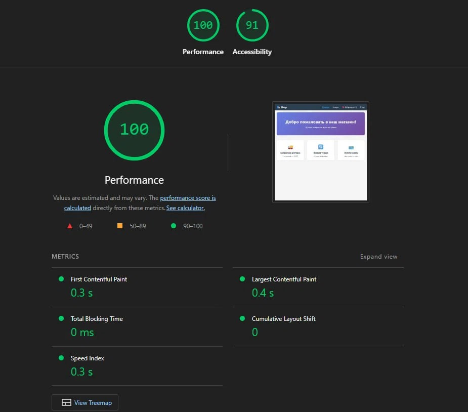

# React Router Shop

Интернет-магазин на React с маршрутизацией, API и избранным.

## Функционал

### Задание 1
- Маршрутизация с React Router
- Главная страница
- Список товаров
- Детальная страница товара
- Страница "О нас"
- Загрузка данных с FakeStore API
- Обработка ошибок и состояние загрузки
- Избранное с Context API
- Сохранение избранного в localStorage

### Задание 2
- Страница избранного /favourites
- Удаление товаров из избранного
- Статистика (количество товаров, общая стоимость)
- React.memo для оптимизации компонентов
- useCallback и useMemo для мемоизации
- Ленивая загрузка страниц (React.lazy + Suspense)
- Тесты (Jest + React Testing Library) - 5 тестов пройдено
- Lighthouse: Performance 100, Accessibility 100

## Результаты Lighthouse



## Технологии

- React 18
- React Router v6
- Context API
- FakeStore API
- CSS Modules
- Jest и React Testing Library

## Установка и запуск

```bash
git clone <your-repo-url>
cd react-router-shop
npm install
npm start
